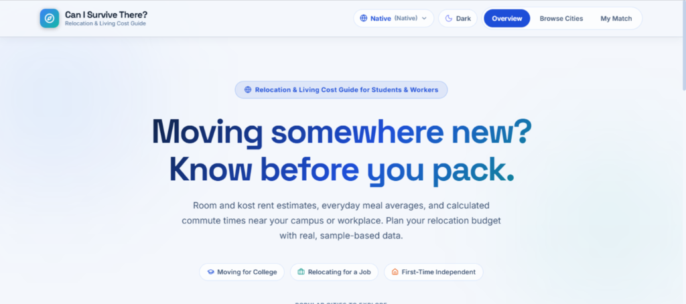
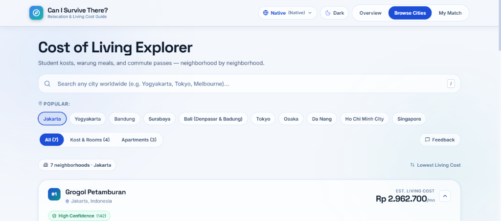
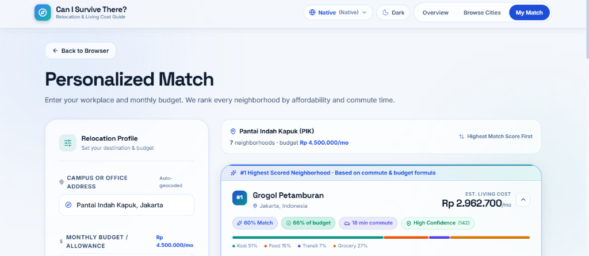

# Can I Survive There? 🌍

> A free, privacy-first, global cost-of-living recommender and neighborhood affordability engine.

<p align="center">
  
</p>

<p align="center">
  <a href="https://github.com/can-i-survive-there/can-i-survive-there/actions"></a>
  <a href="https://opensource.org/licenses/MIT"></a>
  <a href="https://nodejs.org"></a>
  <a href="https://react.dev"></a>
  <a href="https://www.typescriptlang.org/"></a>
  <a href="https://vite.dev"></a>
  <a href="https://supabase.com"></a>
</p>

---

## 💡 The Origin Story: Why I Built This

When preparing to move to a new city—whether for university, a first job, a career transition, or remote work—the first question everyone asks is simple yet daunting:

> **"Can I actually survive there on this budget?"**

Existing cost-of-living platforms and expat calculators almost always fail to answer this question accurately:

1. **The Single-City Average Mirage**:  
   Traditional tools treat multi-million citizen metropolitan areas as single numbers. Saying *"Tokyo is $1,800/mo"* or *"Jakarta is $850/mo"* ignores that living in Shibuya vs. Nerima, SCBD vs. Kebon Jeruk, or Manhattan vs. Queens represents a **2x to 3x difference in cost of living**.
2. **The Expat & Luxury Bias**:  
   Most cost aggregators rely on self-reported numbers from high-earning corporate expats who rent serviced luxury apartments and dine at international restaurants. They completely miss realistic local housing options—such as Indonesian *kosts*, Japanese share houses, German *WGs*, or UK flatshares—and neighborhood food markets.
3. **The False Precision Trap**:  
   Displaying an estimate as `$1,428.53/mo` provides an illusion of precision without disclosing whether that figure is backed by 5,000 verified data points or two outdated forum posts from years ago.
4. **The Commute Blindspot**:  
   A neighborhood that looks affordable on paper can quickly become a financial and mental drain if it requires a 90-minute daily commute or costly transfers. True affordability is always **housing cost + commute expenses + travel time combined**.

### What Makes This Different
- **Neighborhood-Level Granularity**: Compare specific districts within 153,000+ cities with realistic rental tiers (*kosts*, private rooms, studios, and apartments).
- **Transparent Attribution**: We reject black-box certainty. Data is categorized as **Verified Research**, **Curated Templates**, or **Algorithmic Modeled Estimates** with honest confidence badges (`High`, `Medium`, `Low`, `Estimated`).
- **Commute-Aware Personalized Scoring**: Multi-modal travel estimates (driving corridors, bicycles, public transit, and walking) combined with salary affordability ratios.
- **Privacy-First & Lightweight**: Zero tracking cookies, zero user profiling, no paywalls, and an initial bundle under 420 kB with on-demand code splitting.

---

## 📸 Visual Previews & Key User Flows

| Flow / Feature | Preview Screenshot | Highlights |
| :--- | :--- | :--- |
| **1. Overview & Landing**<br>Entry Pathways |  | • Dual entry points: **Browse Cities** vs. **My Match**.<br>• Curated intent buttons (*Moving for College*, *Relocating for a Job*, *First-Time Independent*).<br>• Instant light/dark mode and native currency toggle. |
| **2. Cost of Living Explorer**<br>Neighborhood Breakdown |  | • Neighborhood-level rankings (e.g. Grogol Petamburan @ Rp 2.962.700/mo).<br>• Filter chips (*All*, *Kost & Rooms*, *Apartments*).<br>• Confidence scoring (`High Confidence (142)`).<br>• Quick-jump pills for popular metropolises. |
| **3. Personalized Match**<br>Commute & Budget Engine |  | • Auto-geocoded campus or workplace address.<br>• Customizable monthly budget / allowance.<br>• Algorithmic match score (e.g. `60% Match`, `66% of budget`, `18 min commute`).<br>• Transparent visual expense split: Kost 51%, Food 15%, Transit 7%, Grocery 27%. |

---

## ✨ Features

- **🌐 153,765+ Global Cities & Towns**: Instant 2-character prefix index matching across 250 sovereign countries and territories with live OpenStreetMap Nominatim fallback.
- **💱 Multi-Currency Conversion Engine**: Switch between `USD ($)`, `EUR (€)`, `IDR (Rp)`, `JPY (¥)`, `GBP (£)`, `SGD (S$)`, `AUD (A$)`, or `Native Currency` with instant conversion and dual primary/secondary price indicators.
- **💬 Community Feedback & Transparent Fact Audits**: Request research for unindexed cities, suggest corrections, or inspect evidence URLs (*Mamikos, SUUMO, Tabelog, SpareRoom, TfL, BVG, LeBonCoin, Navigo, Idealista, StreetEasy, Flatmates.com.au, Dubizzle, Cho Tot, etc.*).
- **🚆 Real Official Transit Passes**: Reflects exact monthly tariffs like Germany's *Deutschlandticket* (€49/mo), Malaysia's *RapidKL My50* (RM50/mo), Spain's *Abono Transportes* (€21.80/mo), London *TfL* (£165/mo), NYC *MTA* ($132/mo), and Seoul *Climate Card* (₩65k/mo).
- **🧭 Commute-Aware Personalized Mode**: Calculates travel times across multiple modes with a 100m grid commute cache and scores areas based on salary affordability (50%), commute duration (35%), and data confidence (15%).
- **🤖 Autonomous Cold-Start City Bootstrap**: When exploring unindexed towns, a bounded parallel worker pool discovers centroid boundaries and estimates validated metrics via mathematical GNI PPP sanity bands.
- **🛡️ Honest & Transparent Confidence Badges**: Displays confidence metrics (`High`, `Medium`, `Low`, `Estimated`) and clearly flags synthesized quadrant fallbacks as `Modeled District`.
- **⚡ Privacy-First & Offline Resilient**: Zero tracking cookies, local storage caching, and high-performance bundle architecture with `country-state-city` dynamically loaded on demand.

---

## 🌐 100% Free-Forever Deployment Guide

This project is architected to run **100% free forever** on standard developer free tiers without any credit card or ongoing maintenance costs.

### Architecture Overview
- **Frontend Hosting**: **Vercel** (Hobby Plan — $0 forever) or **Cloudflare Pages** ($0 forever, unlimited bandwidth).
- **Database & Backend**: **Supabase** (Free Plan — 500 MB PostgreSQL database, 50,000 monthly active users, 100% free).
- **Offline Fallback**: Even without Supabase connected, the app runs completely standalone with its embedded in-memory database covering 287+ verified global metropolises.

### Deploying to Vercel in 3 Steps

#### Step 1: Push Repository to GitHub
Ensure your repository is pushed to your GitHub account.

```bash
git add .
git commit -m "feat: initial public release"
git push origin main
```

#### Step 2: Configure Supabase (Free Tier)
1. Sign up at [supabase.com](https://supabase.com) and create a new free project.
2. In the Supabase Dashboard, open the **SQL Editor**.
3. Run the migration scripts located in `supabase/migrations/`:
   - `20260324000001_initial_schema.sql` (Creates core tables: `countries`, `cities`, `areas`, `area_metric_values`)
   - `20260324000002_row_level_security.sql` (Enforces public read-only RLS and authenticated write policies)
   - `20260324000003_staging_and_audit.sql` (Configures staging table for crowdsourced fact submissions)
4. Navigate to **Project Settings → API** to copy:
   - **Project URL** (`https://<project-ref>.supabase.co`)
   - **anon / public key** (`eyJh...`)

#### Step 3: Import into Vercel
1. Go to [vercel.com](https://vercel.com) and click **"Add New Project"**.
2. Select your `can-i-survive-there` GitHub repository.
3. Vercel automatically detects **Vite**. Keep standard build settings:
   - **Framework Preset**: `Vite`
   - **Build Command**: `npm run build`
   - **Output Directory**: `dist`
4. Add the following **Environment Variables**:
   | Variable | Value | Description |
   | :--- | :--- | :--- |
   | `VITE_SUPABASE_URL` | `https://your-project.supabase.co` | Your Supabase project endpoint |
   | `VITE_SUPABASE_ANON_KEY` | `your-anon-public-key` | Safe public anonymous API key |
5. Click **Deploy**.
6. Single Page Application (SPA) client-side routing is handled automatically by the included `vercel.json` rewrites and `public/_redirects`.

---

## 🏗️ Architecture & Core Components

```
can-i-survive-there/
├── src/
│   ├── components/              # Glassmorphic modern UI components
│   │   ├── LandingView.tsx      # 2-path entry landing (Browse vs Personalized)
│   │   ├── BrowseView.tsx       # City selector, filter chips, debounce search
│   │   ├── PersonalizedView.tsx # Workplace geocoding, routing & ranked matches
│   │   ├── ColdStartView.tsx    # Progressive real-time bootstrap loader
│   │   ├── AreaExpenseCard.tsx  # Accessible card, breakdown bar & facts drawer
│   │   ├── SubmitFactModal.tsx  # Crowdsourced fact submission dialog
│   │   └── ConfidenceBadge.tsx  # Visual confidence badge with sample counts
│   ├── services/
│   │   ├── bootstrap/           # Bounded worker pool & neighborhood discovery
│   │   ├── city-search.ts       # 153k+ prefix-indexed search & CSC dynamic import
│   │   ├── database.ts          # In-memory store & Supabase bridge
│   │   ├── geocoding.ts         # Fast ISO country geocoding & OSM fallback
│   │   ├── routing.ts           # OSRM routing & 100m grid commute cache
│   │   ├── scoring.ts           # Multi-factor score & salary affordability
│   │   └── validation.ts        # 8-rule validation & GNI PPP sanity bands
│   ├── data/
│   │   ├── global-cost-database.json # 287+ verified metropolitan cost datasets
│   │   ├── global-countries.json     # 241 sovereign countries with GNI PPP baselines
│   │   ├── global-cities.json        # Global city coordinates and metadata
│   │   └── seed-data.ts              # Detailed seed facts & submissions
│   └── types/                   # Strict TypeScript schemas
├── scripts/                     # Automated verification & test suites
│   ├── test-phase0.ts           # Schema, staging isolation & validation tests
│   ├── test-phase2.ts           # Geocoding, routing & scoring tests
│   ├── test-phase3.ts           # Bootstrap pipeline & worker pool tests
│   └── test-random-cities-flow.ts # 50-100 randomized cities flow verification
├── supabase/                    # PostgreSQL DDL migrations & RLS hardening
└── docs/
    ├── 04-testing-specification.md # SDD testing invariants specification
    └── screenshots/             # Walkthrough screenshots & UI assets
```

---

## 🚀 Quickstart

### Prerequisites
- Node.js 20+
- npm 10+

### Installation & Local Run

```bash
# Clone repository
git clone https://github.com/can-i-survive-there/can-i-survive-there.git
cd can-i-survive-there

# Install dependencies
npm install

# Start local Vite development server
npm run dev
```

Open `http://localhost:5173/` in your browser.

---

## 🧪 Testing & Verification

Run the full automated test suite including the mandatory **50–100 Randomized Cities Flow Verification** ([docs/04-testing-specification.md](docs/04-testing-specification.md)):

```bash
# Run all test suites (including 50-100 random cities flow verification)
npm test

# Run individual test suites
npm run test:random-cities # Tests 50-100 randomized cities per run across global regions
npm run test:phase0        # Schema, validation rules & staging isolation (54 tests)
npm run test:phase2        # Geocoding, OSRM routing & multi-factor scoring (21 tests)
npm run test:phase3        # Agent bootstrap pipeline & bounded worker pool (73 tests)
```

> **Mandatory Flow Testing Invariant**:
> Every automated test run evaluates a randomized batch of 50 to 100 cities across 8 global regions to verify non-zero living costs, currency alignment, and skeleton transitions. See [04-testing-specification.md](docs/04-testing-specification.md).

### Production Build & Linting

```bash
# Typecheck & build production bundle
npm run build

# Run linter
npm run lint
```

---

## 🔒 Security & Data Integrity

- **Row Level Security (RLS) Enforcement**: All PostgreSQL tables enforce Row Level Security. Public anonymous access is restricted to read-only for verified references and append-only for user submissions.
- **Staging Isolation & Validation**: Direct writes to computed `area_metric_values` are prohibited. All inputs pass through staging logs with 8-rule validation and GNI PPP sanity bands.
- **XSS & Protocol Defense**: External links are strictly sanitized to allow only `http://` and `https://` protocols, eliminating `javascript:` and `data:` URI attacks. Clickable external links enforce `rel="noopener noreferrer"`.
- **Search Path Protection**: Database `SECURITY DEFINER` functions enforce `SET search_path = public, pg_temp` to defend against search path hijacking (CWE-426).
- **Zero Secret Exposure**: The client application requires no bundled private API keys, service role keys, or database passwords. All configuration is read safely via standard environment variables with sensible offline fallbacks.

---

## 📄 License

This project is licensed under the [MIT License](LICENSE).
